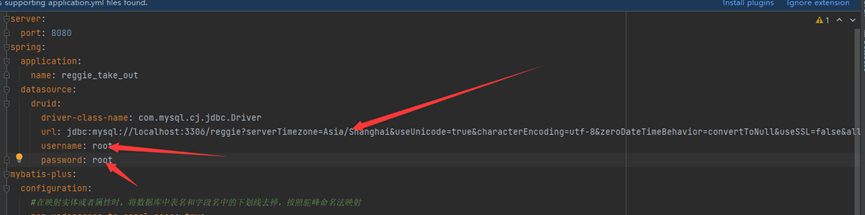
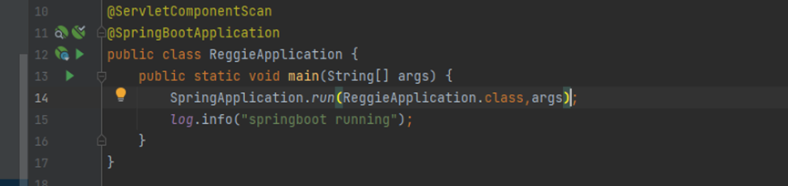

作业所用开发环境：Windows 10，IDEA 2021.3，java 8，mysql 8.0.23
首先建立数据库，数据库名称为reggie。

导入sql文件

修改数据库路径和账号密码

若数据库版本不是8.0.23，采用低版本的mysql需要修改驱动名称，即上图driver-class-name。

修改图片位置，该位置是新增菜品等中上传图片所存储的位置。

运行spring boot启动程序

